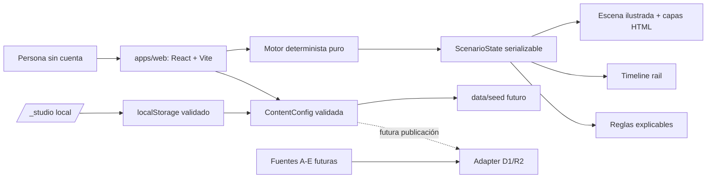

# Arquitectura

## Fronteras

- `src/domain`: tipos, contenido, persistencia local validada y simulación; sin React.
- `src/components`: composición visual y accesibilidad; sin fórmulas de negocio.
- `src/studio`: escenarios, edición local, gráficos, import/export y preview.
- `data/seed`: supuestos de demo con origen explícito.
- `docs`: contrato de fases, fuentes y límites.

## Bucle

1. El usuario selecciona su situación.
2. `selectHousingPath` crea un nuevo estado.
3. `applyAction` usa supuestos serializables y deriva caja, reserva, patrimonio, escena y timeline.
4. `evaluateInsights` aplica reglas con IDs.
5. La UI muestra el nuevo estado y guarda el anterior en undo.

## Futuro

Un API Worker podrá implementar `ScenarioRepository` y `SourceAdapter` sin entrar en componentes. D1 será una implementación, no el contrato. R2 guardará assets/snapshots, nunca secretos en el bundle público.
